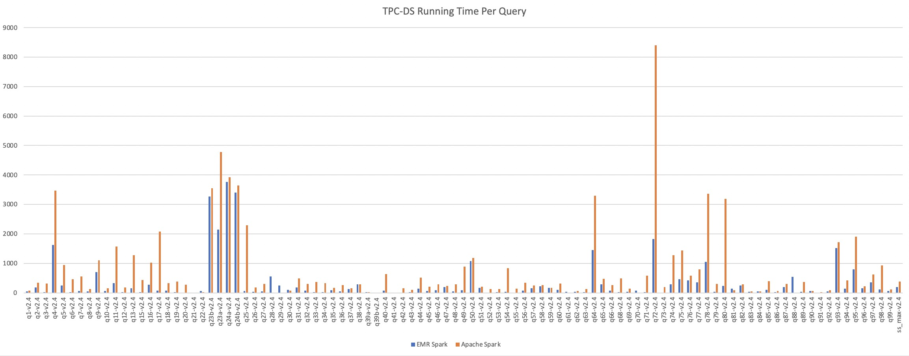
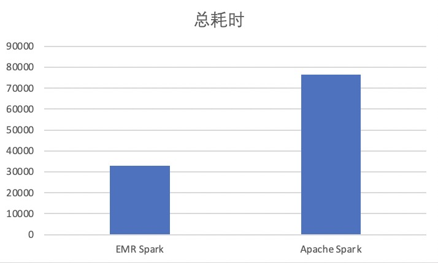
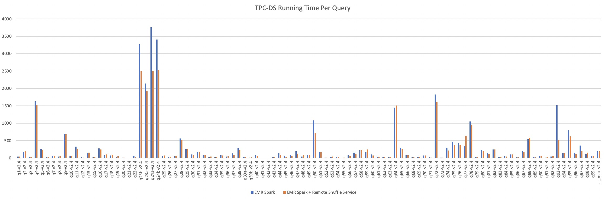
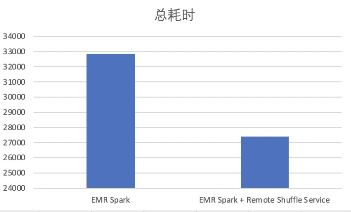
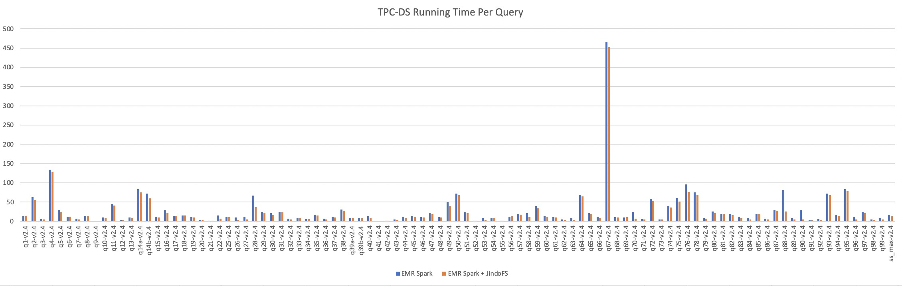
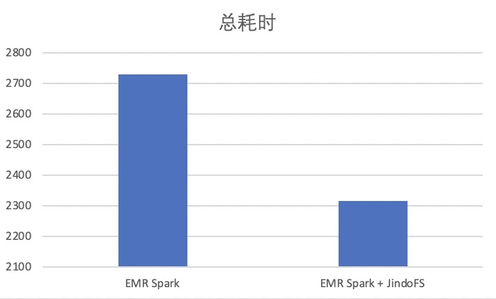

# Apache Spark v.s. EMR Spark on ACK 性能对比

## 概述

本文在同一 ACK 集群环境中分别用 Apache Spark 和阿里云 EMR Spark 运行相同规模的 TPC-DS 基准测试，并对两者的性能进行对比。

## 集群环境

| 集群配置        | 参数                                                         |
| --------------- | ------------------------------------------------------------ |
| 集群类型        | ACK标准集群                                                  |
| 集群版本        | 1.16.9-aliyun.1                                              |
| ECS实例         | ECS规格：ecs.d1ne.6xlarge 操作系统：CentOS 7.7 64位 CPU：24核 内存：96G 数据盘：5500GB HDDx12 |
| Worker Node个数 | 20                                                           |

## 对比结果

### Apache Spark vs EMR Spark

   测试数据：10TB

   

   

   在10TB数据上测试，EMR Spark相比社区版Apache Spark约有57%的性能提升，详细测试过程参考[使用EMR Spark运行Spark工作负载](../bestpractice/emrspark.md)。

### EMR Spark vs EMR Spark + Remote Shuffle Service

   测试数据：10TB

   

   

   在10TB数据上，增加Shuffle Service后，相比直接使用EMR Spark，约有16%的性能提升。详细测试过程请参考[使用EMR Spark + Remote Shuffle Service运行Spark工作负载](../bestpractice/emrspark-ess.md)。

### EMR Spark vs EMR Spark + JindoFS

   测试数据：1TB

   

   

   在1TB数据上，使用JindoFS做数据分布式缓存后，相比直接使用EMR Spark，得到约15%性能提升。详细测试过程请参考[使用EMR Spark + JindoFS运行Spark工作负载](../bestpractice/emrspark-jindofs.md)。
