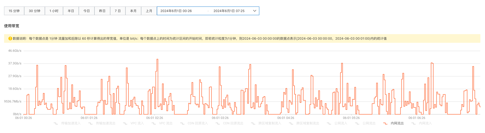

# Spark on ACK TPC-DS 基准测试之使用 Hadoop-Aliyun 模块访问 OSS

本文对在 Spark 作业中使用 [Hadoop-Aliyun](https://hadoop.apache.org/docs/stable/hadoop-aliyun/tools/hadoop-aliyun/index.html) 模块访问阿里云 OSS 的性能进行了数据量规模为 3 TB（SF=3072）的 TPC-DS 基准测试。

## 基准测试环境

本文使用的基准测试环境如下：

| 选项     | 描述                                                          |
| -------- | ------------------------------------------------------------ |
| 集群类型 | ACK Pro 版                                                   |
| K8s 版本 | `1.28.9-aliyun.1`                                            |
| 地域     | 华北2（北京）                                                |
| 节点池   | spark-master 节点池：1 x  `ecs.g7.2xlarge`  spark-worker 节点池：6 x  `ecs.g7.8xlarge` |
| 操作系统 | Alibaba Cloud Linux 3.2104 LTS 64 位                         |
| 镜像 ID  | `aliyun_3_9_x64_20G_alibase_20231219.vhd`                    |
| 云盘     | 每个 worker 节点挂载 6 块 300 GB ESSD PL1 云盘和 1 块 40 GB ESSD PL0 云盘 |

## 生成测试数据

本次基准测试使用的数据集规模为 3 TB（SF=3072），文件格式为 Parquet，分区数量为 640。

关于生成测试数据的详细步骤，请参考[生成 TPC-DS 基准测试数据](../tpcds-data-generation.md)。

## 运行基准测试

关于运行本次 TPC-DS 基准测试的详细步骤，请参考[使用 Hadoop-Aliyun 模块访问阿里云 OSS](../tpcds-benchmark.md)。

## 基准测试结果

本次基准测试共运行 5 轮 TPC-DS 查询，每轮包含 104 条查询语句。基准测试运行时间为 `2024-06-01T00:25:18+08:00` 至 `2024-06-01T7:25:47+08:00` ，基准测试的原始结果已经保存至 [result.csv](result.csv)，结果如下表所示：

| 查询名称    | 最短执行时间（秒） | 最长执行时间（秒） | 平均执行时间（秒） | 标准差（秒） |
| ----------- | ------------------ | ------------------ | ------------------ | ------------ |
| q1-v2.4     | 7.56               | 14.65              | 9.53               | 2.59         |
| q2-v2.4     | 25.82              | 32.47              | 28.55              | 2.45         |
| q3-v2.4     | 5.36               | 7.82               | 6.22               | 0.85         |
| q4-v2.4     | 367.94             | 374.50             | 371.54             | 2.33         |
| q5-v2.4     | 37.33              | 40.20              | 39.25              | 0.99         |
| q6-v2.4     | 13.07              | 15.61              | 14.01              | 0.93         |
| q7-v2.4     | 13.02              | 16.29              | 14.66              | 1.14         |
| q8-v2.4     | 7.49               | 8.76               | 8.20               | 0.48         |
| q9-v2.4     | 79.61              | 87.89              | 83.27              | 3.19         |
| q10-v2.4    | 10.14              | 12.95              | 10.97              | 1.00         |
| q11-v2.4    | 55.87              | 57.54              | 56.63              | 0.54         |
| q12-v2.4    | 4.58               | 5.40               | 4.93               | 0.32         |
| q13-v2.4    | 15.91              | 18.27              | 17.07              | 0.99         |
| q14a-v2.4   | 119.18             | 129.50             | 123.54             | 3.79         |
| q14b-v2.4   | 103.46             | 115.29             | 109.85             | 4.66         |
| q15-v2.4    | 13.84              | 17.99              | 15.42              | 1.37         |
| q16-v2.4    | 43.28              | 55.28              | 47.59              | 4.59         |
| q17-v2.4    | 14.04              | 14.98              | 14.64              | 0.36         |
| q18-v2.4    | 28.40              | 41.95              | 32.24              | 4.92         |
| q19-v2.4    | 7.36               | 8.25               | 7.66               | 0.31         |
| q20-v2.4    | 6.09               | 6.42               | 6.27               | 0.13         |
| q21-v2.4    | 2.38               | 3.42               | 2.88               | 0.39         |
| q22-v2.4    | 16.09              | 17.15              | 16.58              | 0.38         |
| q23a-v2.4   | 258.08             | 269.19             | 265.28             | 3.97         |
| q23b-v2.4   | 368.53             | 388.67             | 380.95             | 7.66         |
| q24a-v2.4   | 189.67             | 209.15             | 196.60             | 7.07         |
| q24b-v2.4   | 169.09             | 182.15             | 175.26             | 4.58         |
| q25-v2.4    | 11.87              | 13.69              | 12.61              | 0.64         |
| q26-v2.4    | 9.31               | 12.23              | 10.95              | 1.17         |
| q27-v2.4    | 11.29              | 15.07              | 13.29              | 1.23         |
| q28-v2.4    | 96.98              | 125.30             | 112.95             | 9.87         |
| q29-v2.4    | 38.80              | 41.98              | 40.07              | 1.28         |
| q30-v2.4    | 20.63              | 21.59              | 21.00              | 0.33         |
| q31-v2.4    | 17.83              | 25.06              | 21.78              | 2.38         |
| q32-v2.4    | 2.72               | 4.68               | 3.34               | 0.70         |
| q33-v2.4    | 9.70               | 12.81              | 11.49              | 1.10         |
| q34-v2.4    | 7.90               | 9.11               | 8.26               | 0.45         |
| q35-v2.4    | 24.45              | 28.42              | 26.07              | 1.40         |
| q36-v2.4    | 10.44              | 14.23              | 12.41              | 1.28         |
| q37-v2.4    | 20.07              | 25.43              | 22.86              | 1.99         |
| q38-v2.4    | 31.00              | 31.96              | 31.29              | 0.35         |
| q39a-v2.4   | 6.86               | 7.23               | 7.06               | 0.12         |
| q39b-v2.4   | 5.61               | 6.39               | 5.92               | 0.27         |
| q40-v2.4    | 16.46              | 21.68              | 19.24              | 1.68         |
| q41-v2.4    | 1.05               | 1.54               | 1.27               | 0.20         |
| q42-v2.4    | 2.55               | 3.90               | 3.40               | 0.47         |
| q43-v2.4    | 8.08               | 9.90               | 8.96               | 0.66         |
| q44-v2.4    | 41.55              | 54.16              | 48.66              | 4.21         |
| q45-v2.4    | 14.81              | 20.57              | 16.85              | 1.96         |
| q46-v2.4    | 13.71              | 15.89              | 14.93              | 0.73         |
| q47-v2.4    | 14.54              | 17.72              | 15.53              | 1.14         |
| q48-v2.4    | 14.50              | 17.40              | 15.99              | 0.99         |
| q49-v2.4    | 29.65              | 42.49              | 37.60              | 4.44         |
| q50-v2.4    | 101.39             | 105.78             | 102.70             | 1.59         |
| q51-v2.4    | 18.69              | 22.02              | 20.03              | 1.28         |
| q52-v2.4    | 2.29               | 4.11               | 3.11               | 0.60         |
| q53-v2.4    | 6.97               | 10.69              | 8.71               | 1.20         |
| q54-v2.4    | 11.41              | 13.93              | 12.60              | 0.83         |
| q55-v2.4    | 2.48               | 3.90               | 3.26               | 0.47         |
| q56-v2.4    | 11.17              | 12.49              | 12.09              | 0.49         |
| q57-v2.4    | 10.01              | 11.79              | 11.04              | 0.59         |
| q58-v2.4    | 4.38               | 7.20               | 5.95               | 1.03         |
| q59-v2.4    | 23.16              | 34.16              | 28.42              | 3.49         |
| q60-v2.4    | 14.73              | 19.66              | 16.51              | 1.79         |
| q61-v2.4    | 8.82               | 11.46              | 9.68               | 0.92         |
| q62-v2.4    | 10.42              | 17.37              | 13.61              | 2.32         |
| q63-v2.4    | 7.42               | 10.96              | 8.66               | 1.31         |
| q64-v2.4    | 131.35             | 164.31             | 142.69             | 11.59        |
| q65-v2.4    | 38.24              | 39.46              | 38.80              | 0.43         |
| q66-v2.4    | 12.81              | 17.16              | 15.06              | 1.45         |
| q67-v2.4    | 769.78             | 781.87             | 775.79             | 4.71         |
| q68-v2.4    | 8.77               | 10.71              | 9.38               | 0.70         |
| q69-v2.4    | 9.78               | 11.11              | 10.51              | 0.55         |
| q70-v2.4    | 18.57              | 22.76              | 20.13              | 1.53         |
| q71-v2.4    | 6.32               | 9.28               | 7.46               | 1.02         |
| q72-v2.4    | 34.55              | 37.86              | 35.79              | 1.14         |
| q73-v2.4    | 4.63               | 4.80               | 4.72               | 0.07         |
| q74-v2.4    | 47.74              | 48.63              | 48.02              | 0.33         |
| q75-v2.4    | 83.77              | 87.94              | 85.45              | 1.51         |
| q76-v2.4    | 47.90              | 53.09              | 50.02              | 1.88         |
| q77-v2.4    | 4.63               | 5.53               | 5.02               | 0.33         |
| q78-v2.4    | 140.07             | 148.79             | 144.36             | 3.79         |
| q79-v2.4    | 8.04               | 10.58              | 8.75               | 0.95         |
| q80-v2.4    | 37.68              | 43.78              | 39.85              | 2.24         |
| q81-v2.4    | 17.39              | 19.72              | 18.40              | 0.81         |
| q82-v2.4    | 37.87              | 39.37              | 38.38              | 0.54         |
| q83-v2.4    | 2.24               | 3.01               | 2.67               | 0.26         |
| q84-v2.4    | 11.59              | 16.41              | 13.52              | 1.71         |
| q85-v2.4    | 17.73              | 25.71              | 19.67              | 3.04         |
| q86-v2.4    | 4.82               | 8.15               | 5.78               | 1.20         |
| q87-v2.4    | 30.76              | 34.14              | 31.88              | 1.20         |
| q88-v2.4    | 90.15              | 114.13             | 96.31              | 9.03         |
| q89-v2.4    | 8.61               | 11.53              | 9.69               | 0.99         |
| q90-v2.4    | 11.34              | 15.82              | 12.58              | 1.64         |
| q91-v2.4    | 4.00               | 5.58               | 4.74               | 0.53         |
| q92-v2.4    | 2.68               | 3.69               | 3.06               | 0.34         |
| q93-v2.4    | 169.17             | 178.82             | 176.07             | 3.60         |
| q94-v2.4    | 32.83              | 41.11              | 36.38              | 3.05         |
| q95-v2.4    | 91.74              | 95.36              | 93.64              | 1.44         |
| q96-v2.4    | 14.03              | 19.41              | 16.28              | 2.12         |
| q97-v2.4    | 40.72              | 42.97              | 42.01              | 0.80         |
| q98-v2.4    | 7.21               | 9.16               | 7.98               | 0.68         |
| q99-v2.4    | 14.98              | 18.43              | 16.48              | 1.27         |
| ss_max-v2.4 | 28.86              | 35.44              | 31.92              | 2.30         |
| 总计        | 79分2秒            | 87分53秒           | 82分钟59秒         |              |

## 性能分析

### OSS 使用带宽

OSS 使用带宽如下图所示：

本次基准测试使用带宽峰值为 40.5 Gb/s，单个阿里云账号在北京地域的 OSS 默认内外网总下载带宽为 100 Gb/s，OSS 带宽尚未达到瓶颈。

### CPU 使用率

Worker 节点池总共包含 6 个节点，随机选择其中一个节点查看各项性能指标。

CPU 使用率如下图所示：

CPU 使用率峰值为 96% 左右。

### 内存使用率

内存使用率如下图所示：

内存使用率平均值为 82% 左右。

### 系统负载

系统负载如下图所示：

系统负载平均值为 20% 左右，峰值为 33% 左右。

### 云盘读写 BPS

云盘读写 BPS 如下图所示：

云盘读/写 BPS 峰值分别为 359/650 MB/s，即 2.8/5.1 Gb/s，`ecs.g7.8xlarge` 实例基础云盘带宽为 8 Gb/s，尚未达到瓶颈。

### 云盘读写 IOPS

云盘读写 IOPS 如下图所示：

云盘读/写 IOPS 峰值分别为 3.3/3.0k 左右，`ecs.g7.8xlarge` 实例基础 IOPS 为 16 万，尚未达到瓶颈。

### 内网带宽

内网带宽如下图所示：

内网带宽峰值为 11.3 Gb/s 左右，`ecs.g7.8xlarge` 实例基础/突发网络带宽为 16/32 Gb/s，尚未达到瓶颈。
