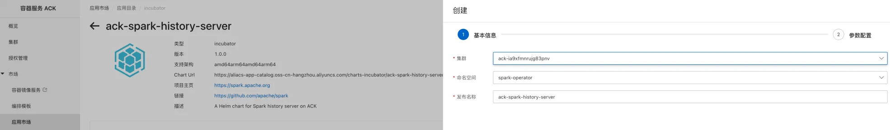
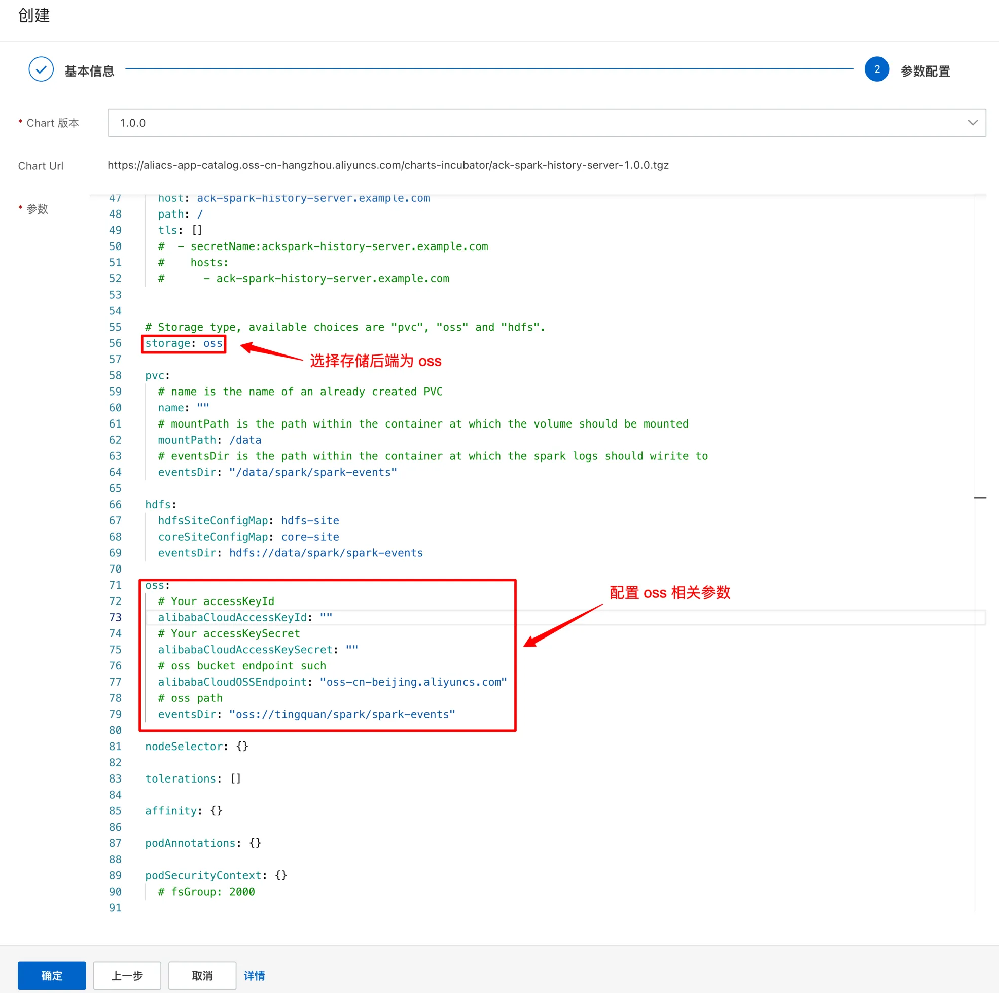

# 搭建 Spark on ACK 基准测试环境

本文介绍如何搭建 Spark on ACK 基准测试环境。

## 安装 Terraform

[Terraform](https://www.terraform.io/) 是一个开源的基础设施即代码（Infrastructure as Code，IaC）工具，由 HashiCorp 公司开发。它允许用户以声明式的方式定义和管理云基础架构和网络资源，如计算实例、存储、网络配置、负载均衡器、数据库等，甚至是 Kubernetes 集群和服务网格等复杂应用基础设施。使用 Terraform 能够以基础设施即代码的方式管理基准测试所需的集群环境，从而方便用户复现。因此，本文将使用 Terraform 来管理集群环境。

首先，需要安装 `terraform` 命令行工具，在 macOS 操作系统中，可以执行如下命令进行安装：

```shell
brew tap hashicorp/tap
brew install hashicorp/tap/terraform
```

更多其他操作系统的安装方式，请参考 [Install | Terraform | HashiCorp Developer](https://developer.hashicorp.com/terraform/install)。

Terraform CLI 自 `v0.13.2` 开始支持网络镜像特性，为了解决下载 `alicloud` Provider 时由于网络超时等原因造成下载失败的问题，阿里云提供了 Terraform 镜像源服务，您可以配置 Terraform 使用阿里云镜像源以加速访问，执行如下脚本将所需配置写入 `~/.terraformrc` 文件：

```shell
cat <<EOF > ~/.terraformrc
plugin_cache_dir = "$HOME/.terraform.d/plugin-cache"

provider_installation {
  network_mirror {
    url = "https://mirrors.aliyun.com/terraform/"
    // Setting alicloud from Alibaba Cloud Mirror Service
    include = ["registry.terraform.io/aliyun/alicloud",
               "registry.terraform.io/hashicorp/alicloud",
              ]
  }
  direct {
    // setting other providers from Terraform Registry
    exclude = ["registry.terraform.io/aliyun/alicloud",
               "registry.terraform.io/hashicorp/alicloud",
              ]
  }
}

EOF
```

## 下载代码

```shell
git clone https://github.com/AliyunContainerService/benchmark-for-spark.git

cd benchmark-for-spark
```

## 配置 Terraform

切换到 `terraform/alicloud` 目录下：

```shell
cd terraform/alicloud
```

terraform 配置文件目录结构如下：

```shell
$ tree -L 2    
.
├── datasources.tf       # 数据源
├── main.tf              # 配置文件
├── modules              # 子模块定义
│   ├── celeborn
│   ├── cs
│   ├── eci
│   ├── ecs
│   ├── fluid
│   ├── oss
│   ├── resource-manager
│   ├── spark
│   └── vpc
├── outputs.tf           # 输出参数
├── provider.tf          # 配置阿里云
├── root.tf              # root 配置文件
├── terraform.tfvars     # 输入参数
└── variables.tf         # 输入变量定义
```

本文采用模块化的方式来管理阿里云基础设施资源，其中 `modules` 目录下存放了各个模块的定义文件，包括：

- **resource-manager 模块**：用于创建资源组
- **vpc 模块**：用于创建 VPC 资源
- **ecs 模块**：用于创建安全组资源
- **cs 模块**：用于创建 ACK 集群，不包含节点池
- **oss 模块**（可选）：用于创建 OSS 存储桶
- **spark 模块**（可选）：用于创建 `spark-master` 和 `spark-worker` 两个节点池
- **fluid 模块**（可选）：用于创建 `fluid` 节点池
- **celeborn 模块**（可选）：用于创建 `celeborn` 节点池
- **eci 模块**（可选）：用于向 ACK 集群安装 `ack-virtual-node` 插件

### 配置阿里云访问凭据

通过设置环境变量的方式来配置阿里云访问凭据：

```shell
export ALICLOUD_ACCESS_KEY=<ACCESS_KEY_ID>
export ALICLOUD_SECRET_KEY=<ACCESS_KEY_SECRET>
```

其中 `<ACCESS_KEY_ID>` 和 `<ACCESS_KEY_SECRET>` 需要替换成你的阿里云 AccessKey ID 和 AccessKey Secret。

或者你也可以通过[配置阿里云 CLI](https://help.aliyun.com/cli/overview) 的方式配置访问凭据：

- 在 Linux 和 macOS 系统中，访问凭据默认位于 `${HOME}/.aliyun/config.json`
- 在 Windows 系统中，访问凭据默认位于 `%USERPROFILE%\.aliyun\config.json`。默认使用 `config.json` 中名为 `default` 的 profile，如果你需要指定其他 profile，可以在 `terraform.tfvars` 文件中修改 `profile` 配置参数。

### 选择要创建的模块

在 `root.tf` 配置文件中可以配置需要创建的模块，对于可选模块，如果不需要创建，用 `#` 将其注释掉即可：

```terraform
# Create resource group
module "resource_manager" {
  source = "./modules/resource-manager"
  suffix = random_string.suffix.id
}

# Create VPC and vswitch
module "vpc" {
  source            = "./modules/vpc"
  suffix            = random_string.suffix.id
  zone_id           = var.zone_id
  resource_group_id = module.resource_manager.resource_group_id
}

# Create security group
module "ecs" {
  source            = "./modules/ecs"
  suffix            = random_string.suffix.id
  vpc_id            = module.vpc.vpc_id
  resource_group_id = module.resource_manager.resource_group_id
}

# # module "oss" {
#   source = "./modules/oss"
#   suffix = random_string.suffix.id
# }

# Create ACK
module "cs" {
  source             = "./modules/cs"
  suffix             = random_string.suffix.id
  worker_vswitch_ids = [module.vpc.vswitch_id]
  pod_vswitch_ids    = [module.vpc.vswitch_id]
  resource_group_id  = module.resource_manager.resource_group_id
  security_group_id  = module.ecs.security_group_id
}

# Create node pool for spark
module "spark" {
  source                = "./modules/spark"
  suffix                = random_string.suffix.id
  cluster_id            = module.cs.cluster_id
  vswitch_ids           = [module.vpc.vswitch_id]
  master_instance_count = var.spark_master_instance_count
  master_instance_type  = var.spark_master_instance_type
  worker_instance_count = var.spark_worker_instance_count
  worker_instance_type  = var.spark_worker_instance_type
  resource_group_id     = module.resource_manager.resource_group_id
  security_group_id     = module.ecs.security_group_id
}

# # Create node pool for fluid
# module "fluid" {
#   source            = "./modules/fluid"
#   suffix            = random_string.suffix.id
#   cluster_id        = module.cs.cluster_id
#   vswitch_ids       = [module.vpc.vswitch_id]
#   instance_count    = var.fluid_instance_count
#   instance_type     = var.fluid_instance_type
#   resource_group_id = module.resource_manager.resource_group_id
#   security_group_id = module.ecs.security_group_id
# }

# # Create node pool for celeborn
# module "celeborn" {
#   source            = "./modules/celeborn"
#   suffix            = random_string.suffix.id
#   cluster_id        = module.cs.cluster_id
#   vswitch_ids       = [module.vpc.vswitch_id]
#   instance_count    = var.celeborn_instance_count
#   instance_type     = var.celeborn_instance_type
#   resource_group_id = module.resource_manager.resource_group_id
#   security_group_id = module.ecs.security_group_id
# }

# # Install ack-virtual-node addon
# module "eci" {
#   source     = "./modules/eci"
#   cluster_id = module.cs.cluster_id
# }
```

### 修改输入参数

你可以通过修改配置文件 `terraform.tfvars` 来配置集群的规模和实例规格：

```terraform
# Alicloud
zone_id = "cn-beijing-i"

# Spark
spark_master_instance_count = 1
spark_master_instance_type  = "ecs.g7.2xlarge"
spark_worker_instance_count = 6
spark_worker_instance_type  = "ecs.g7.8xlarge"

# Fluid
fluid_instance_count = 3
fluid_instance_type  = "ecs.i3.2xlarge"

# Celeborn
celeborn_instance_count = 3
celeborn_instance_type  = "ecs.i3.2xlarge"
```

注：

- 对于可选模块，如果没有启用，相应的配置参数忽略掉即可。

### 创建资源

执行如下命令初始化 terraform：

```shell
terraform init
```

该命令执行完成后会在当前目录下创建 `.terraform` 目录用于存储相关配置信息。

执行如下命令创建阿里云各项资源：

```shell
terraform apply
```

该命令执行完成后会在当前目录下创建 `terraform.tfstate` 和 `terraform.tfstate.backup` 等文件用于存储状态信息。

⚠️ 注意事项：

- 新创建的 ACK 集群的 kubeconfig 文件会直接保存到 `~/.kube/config`，请注意对原有的 kubeconfig 文件进行备份。

## 创建 Fluid 节点池（可选）

如果需要创建 Fluid 节点池，在 `terraform/alicloud/root.tf` 文件中取消注释 fluid 模块：

```terraform
# Create node pool for fluid
module "fluid" {
  source            = "./modules/fluid"
  suffix            = random_string.suffix.id
  cluster_id        = module.cs.cluster_id
  vswitch_ids       = [module.vpc.vswitch_id]
  instance_count    = var.fluid_instance_count
  instance_type     = var.fluid_instance_type
  resource_group_id = module.resource_manager.resource_group_id
  security_group_id = module.ecs.security_group_id
}
```

并在 `terraform/alicloud/terraform.tfvars` 文件中配置 fluid 节点池相关参数，包括节点数量和实例类型：

```terraform
# Fluid
fluid_instance_count = 1
fluid_instance_type  = "ecs.i3.2xlarge"
```

然后执行如下命令创建 Fluid 节点池资源：

```shell
# 仅在第一次启用该模块时需要执行初始化
terraform init

# 创建资源
terraform apply
```

## 部署 ack-spark-operator

1. 如果尙未添加阿里云容器服务 Helm chart 仓库，执行如下命令进行添加：

    ```shell
    helm repo add --force-update aliyunhub https://aliacs-app-catalog.oss-cn-hangzhou.aliyuncs.com/charts-incubator
    ```

2. 执行如下命令，部署阿里云 `ack-spark-operator` 组件：

    ```shell
    helm install spark-operator aliyunhub/ack-spark-operator \
        --version 2.1.0 \
        --namespace spark \
        --create-namespace \
        --set image.registry=registry-cn-beijing-vpc.ack.aliyuncs.com \
        --set 'spark.jobNamespaces={default}' \
        --set spark.serviceAccount.name=spark
    ```

## 安装 ack-spark-history-server（可选）

ack-spark-history-server 支持使用 PVC、OSS 和 HDFS 作为日志存储后端，本次演示使用 OSS 来存储 spark 事件日志，首先，需要在 OSS bucket 中创建相应的目录，例如 `oss://tingquan/spark/spark-events`。

接下来，开始安装 ack-spark-history-server，安装路径为 ACK 控制台 -> 应用市场 -> ack-spark-history-server。



chart 版本选择 1.0.0，在配置参数中修改存储后端类型和相应的参数：



查看是否安装成功：

```shell
$ helm status -n spark-operator ack-spark-history-server
NAME: ack-spark-history-server
LAST DEPLOYED: Wed Dec  6 11:22:51 2023
NAMESPACE: spark-operator
STATUS: deployed
REVISION: 1
NOTES:
1. Get the application URL by running these commands:
export SERVICE_NAME=$(kubectl get service ack-spark-history-server --namespace spark-operator -o jsonpath="{.metadata.name}")
export SERVICE_PORT=$(kubectl get service ack-spark-history-server --namespace spark-operator -o jsonpath="{.spec.ports[0].port}")
kubectl port-forward --namespace spark-operator services/${SERVICE_NAME} ${SERVICE_PORT} &>/dev/null &
echo "Now you can go to http://127.0.0.1:${SERVICE_PORT} to visit spark history server."
```

复制命令并执行以进行端口转发：

```shell
$ export SERVICE_NAME=$(kubectl get service ack-spark-history-server --namespace spark-operator -o jsonpath="{.metadata.name}")
export SERVICE_PORT=$(kubectl get service ack-spark-history-server --namespace spark-operator -o jsonpath="{.spec.ports[0].port}")
kubectl port-forward --namespace spark-operator services/${SERVICE_NAME} ${SERVICE_PORT} &>/dev/null &
echo "Now you can go to http://127.0.0.1:${SERVICE_PORT} to visit spark history server."
[1] 4782
Now you can go to http://127.0.0.1:18080 to visit spark history server.
```

在浏览器中输入 [http://127.0.0.1:18080](http://127.0.0.1:18080) 即可查看 Web UI。

⚠️ 注意事项：

- `kubectl port-forward` 建立的端口转发仅适用于测试环境下的快速验证，不适合在生产环境使用，使用时请注意安全风险。

## 释放资源

在基准测试完成之后可以执行如下命令释放资源：

```shell
terraform destroy
```
