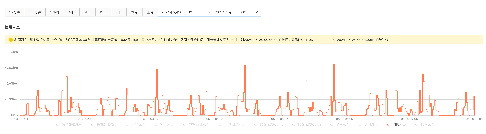
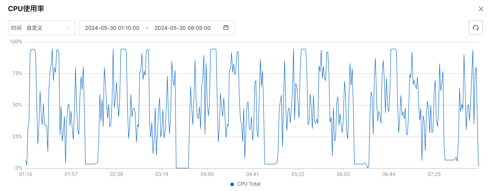
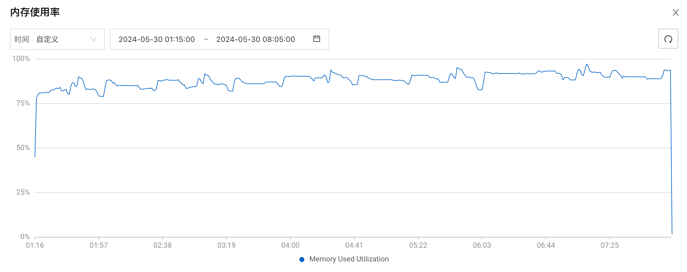
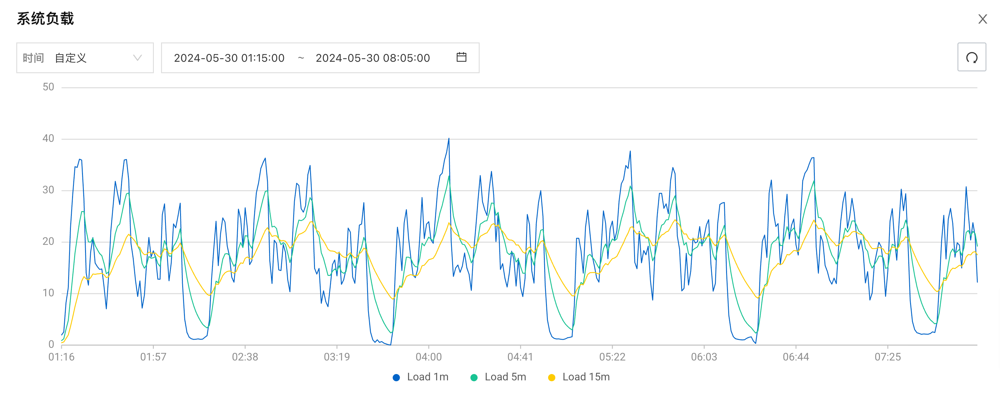
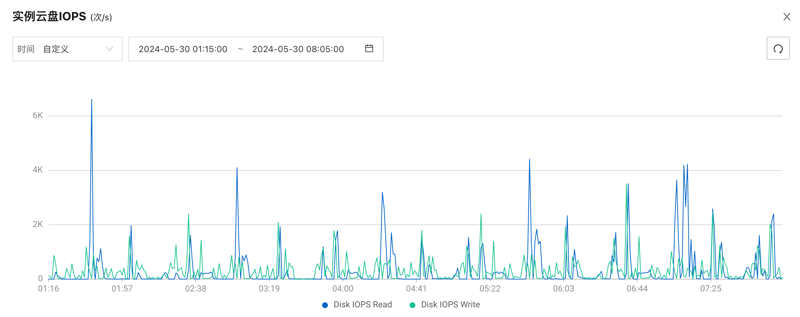
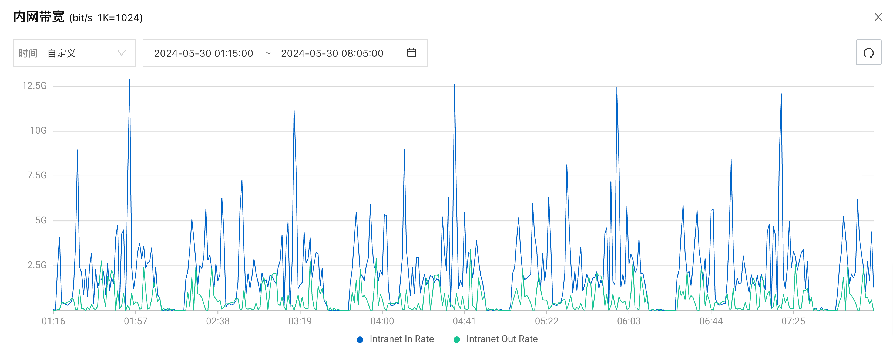

# Spark on ACK TPC-DS 基准测试

本文在 ACK 集群容器环境中对 Spark 进行了数据规模为 3 TB 的基准测试。

## 基准测试环境

本文使用的基准测试环境如下：

| 选项     | 描述                                                         |
| -------- | ------------------------------------------------------------ |
| 集群类型 | ACK Pro 版                                                   |
| K8s 版本 | `1.28.9-aliyun.1`                                            |
| 地域     | 华北2（北京）                                                |
| 节点池   | spark-master 节点池：1 x  `ecs.g8y.2xlarge` spark-worker 节点池：6 x  `ecs.g8y.8xlarge |
| 操作系统 | Alibaba Cloud Linux 3.2104 LTS 64位 ARM版                    |
| 镜像 ID  | `aliyun_3_arm64_20G_alibase_20230731.vhd`                    |
| 云盘     | 每个 worker 节点挂载 6 块 300 GB ESSD PL1 云盘和 1 块 40 GB ESSD PL0 云盘 |

## 生成测试数据

本次基准测试使用的数据集规模为 3 TB（SF=3072），文件格式为 Parquet，分区数量为 640。

关于生成测试数据的详细步骤，请参考[生成 TPC-DS 基准测试数据](../tpcds-data-generation.md)。

## 运行基准测试

关于运行 TPC-DS 基准测试的详细步骤，请参考[运行 TPC-DS 基准测试](../tpcds-benchmark.md)。

## 基准测试结果

本次基准测试共运行 5 轮 TPC-DS 查询，每轮包含 104 条查询语句。基准测试运行时间为 `2024-05-30T1:14:59+08:00` 至 `2024-05-30T08:04:06+08:00` ，基准测试的原始结果已经保存至 [result.csv](result.csv)，结果如下表所示：

| 查询名称    | 最短执行时间（秒） | 最长执行时间（秒） | 平均执行时间（秒） | 标准差（秒） |
| ----------- | ------------------ | ------------------ | ------------------ | ------------ |
| q1-v2.4     | 6.40               | 14.11              | 8.11               | 3.01         |
| q2-v2.4     | 24.85              | 42.72              | 30.24              | 6.46         |
| q3-v2.4     | 4.43               | 10.66              | 6.05               | 2.32         |
| q4-v2.4     | 411.27             | 416.43             | 413.10             | 1.75         |
| q5-v2.4     | 37.22              | 40.84              | 38.18              | 1.36         |
| q6-v2.4     | 15.25              | 16.98              | 16.13              | 0.73         |
| q7-v2.4     | 10.66              | 17.72              | 12.91              | 2.54         |
| q8-v2.4     | 7.97               | 10.24              | 8.68               | 0.83         |
| q9-v2.4     | 78.28              | 91.74              | 84.78              | 5.34         |
| q10-v2.4    | 7.93               | 9.74               | 8.86               | 0.71         |
| q11-v2.4    | 44.77              | 46.99              | 46.02              | 0.80         |
| q12-v2.4    | 4.78               | 5.66               | 5.07               | 0.32         |
| q13-v2.4    | 13.57              | 16.94              | 15.04              | 1.15         |
| q14a-v2.4   | 127.97             | 133.40             | 130.09             | 1.96         |
| q14b-v2.4   | 111.96             | 123.44             | 117.29             | 4.12         |
| q15-v2.4    | 13.65              | 14.30              | 14.03              | 0.25         |
| q16-v2.4    | 38.16              | 51.28              | 44.04              | 4.39         |
| q17-v2.4    | 12.38              | 13.59              | 12.92              | 0.39         |
| q18-v2.4    | 29.76              | 32.58              | 30.87              | 0.96         |
| q19-v2.4    | 7.58               | 8.49               | 8.06               | 0.30         |
| q20-v2.4    | 6.07               | 6.52               | 6.35               | 0.17         |
| q21-v2.4    | 2.33               | 3.04               | 2.62               | 0.30         |
| q22-v2.4    | 15.79              | 17.47              | 16.35              | 0.61         |
| q23a-v2.4   | 247.19             | 269.19             | 256.79             | 9.14         |
| q23b-v2.4   | 347.10             | 376.91             | 359.68             | 10.84        |
| q24a-v2.4   | 170.73             | 222.39             | 186.82             | 18.85        |
| q24b-v2.4   | 154.57             | 181.78             | 161.58             | 10.19        |
| q25-v2.4    | 10.17              | 11.31              | 10.80              | 0.42         |
| q26-v2.4    | 8.32               | 10.91              | 9.57               | 0.87         |
| q27-v2.4    | 9.16               | 11.34              | 10.13              | 0.80         |
| q28-v2.4    | 86.43              | 100.02             | 93.71              | 4.53         |
| q29-v2.4    | 34.69              | 37.39              | 35.68              | 1.10         |
| q30-v2.4    | 22.22              | 24.36              | 23.56              | 0.79         |
| q31-v2.4    | 15.54              | 22.44              | 19.17              | 2.78         |
| q32-v2.4    | 2.72               | 4.29               | 3.41               | 0.52         |
| q33-v2.4    | 9.49               | 14.05              | 10.84              | 1.67         |
| q34-v2.4    | 5.75               | 6.86               | 6.33               | 0.36         |
| q35-v2.4    | 22.05              | 28.68              | 25.55              | 2.13         |
| q36-v2.4    | 9.20               | 11.34              | 10.17              | 0.80         |
| q37-v2.4    | 20.61              | 25.34              | 22.76              | 1.63         |
| q38-v2.4    | 24.36              | 25.89              | 25.01              | 0.56         |
| q39a-v2.4   | 7.21               | 7.90               | 7.57               | 0.24         |
| q39b-v2.4   | 6.19               | 6.46               | 6.33               | 0.11         |
| q40-v2.4    | 12.70              | 15.12              | 13.61              | 0.94         |
| q41-v2.4    | 0.74               | 1.06               | 0.85               | 0.12         |
| q42-v2.4    | 2.14               | 2.57               | 2.34               | 0.17         |
| q43-v2.4    | 5.22               | 5.90               | 5.58               | 0.27         |
| q44-v2.4    | 35.77              | 43.12              | 39.09              | 2.73         |
| q45-v2.4    | 14.68              | 16.24              | 15.26              | 0.65         |
| q46-v2.4    | 14.43              | 15.69              | 15.28              | 0.46         |
| q47-v2.4    | 15.57              | 16.56              | 16.02              | 0.35         |
| q48-v2.4    | 13.14              | 14.17              | 13.58              | 0.35         |
| q49-v2.4    | 24.85              | 27.81              | 25.95              | 1.02         |
| q50-v2.4    | 88.90              | 106.74             | 97.01              | 6.73         |
| q51-v2.4    | 17.65              | 18.52              | 18.09              | 0.32         |
| q52-v2.4    | 2.12               | 2.22               | 2.18               | 0.04         |
| q53-v2.4    | 5.54               | 6.95               | 6.13               | 0.48         |
| q54-v2.4    | 10.48              | 12.00              | 11.15              | 0.58         |
| q55-v2.4    | 2.28               | 2.60               | 2.47               | 0.11         |
| q56-v2.4    | 9.01               | 13.74              | 10.56              | 1.66         |
| q57-v2.4    | 10.85              | 11.81              | 11.32              | 0.31         |
| q58-v2.4    | 5.29               | 6.05               | 5.73               | 0.29         |
| q59-v2.4    | 24.30              | 26.35              | 25.00              | 0.71         |
| q60-v2.4    | 13.17              | 18.01              | 15.62              | 1.73         |
| q61-v2.4    | 7.92               | 8.87               | 8.46               | 0.35         |
| q62-v2.4    | 8.17               | 11.19              | 9.52               | 1.08         |
| q63-v2.4    | 5.25               | 6.69               | 6.13               | 0.50         |
| q64-v2.4    | 131.18             | 139.66             | 136.39             | 3.69         |
| q65-v2.4    | 39.53              | 41.44              | 40.65              | 0.74         |
| q66-v2.4    | 11.94              | 16.27              | 13.36              | 1.53         |
| q67-v2.4    | 824.83             | 953.59             | 876.58             | 43.60        |
| q68-v2.4    | 8.02               | 9.79               | 8.83               | 0.66         |
| q69-v2.4    | 8.09               | 9.68               | 8.61               | 0.59         |
| q70-v2.4    | 12.52              | 14.41              | 13.34              | 0.62         |
| q71-v2.4    | 4.80               | 6.90               | 6.14               | 0.87         |
| q72-v2.4    | 30.19              | 33.34              | 31.85              | 1.26         |
| q73-v2.4    | 4.08               | 4.76               | 4.39               | 0.23         |
| q74-v2.4    | 39.61              | 42.03              | 40.54              | 0.93         |
| q75-v2.4    | 76.18              | 84.96              | 79.19              | 3.66         |
| q76-v2.4    | 48.11              | 60.20              | 52.70              | 4.47         |
| q77-v2.4    | 3.66               | 4.68               | 4.10               | 0.36         |
| q78-v2.4    | 135.27             | 144.13             | 138.51             | 3.25         |
| q79-v2.4    | 7.34               | 8.52               | 7.81               | 0.42         |
| q80-v2.4    | 33.40              | 38.88              | 35.24              | 1.97         |
| q81-v2.4    | 19.42              | 46.43              | 36.52              | 9.47         |
| q82-v2.4    | 37.40              | 41.27              | 39.64              | 1.61         |
| q83-v2.4    | 2.18               | 3.33               | 2.67               | 0.37         |
| q84-v2.4    | 8.53               | 9.85               | 9.23               | 0.52         |
| q85-v2.4    | 13.00              | 16.70              | 14.89              | 1.18         |
| q86-v2.4    | 4.90               | 5.44               | 5.15               | 0.18         |
| q87-v2.4    | 24.39              | 25.13              | 24.56              | 0.28         |
| q88-v2.4    | 78.76              | 91.61              | 84.54              | 4.24         |
| q89-v2.4    | 7.45               | 9.86               | 8.31               | 0.87         |
| q90-v2.4    | 9.02               | 12.04              | 9.88               | 1.10         |
| q91-v2.4    | 3.31               | 5.37               | 3.87               | 0.76         |
| q92-v2.4    | 2.28               | 3.17               | 2.55               | 0.32         |
| q93-v2.4    | 189.06             | 193.99             | 191.69             | 2.02         |
| q94-v2.4    | 29.17              | 34.98              | 31.34              | 2.01         |
| q95-v2.4    | 72.10              | 76.89              | 74.06              | 1.71         |
| q96-v2.4    | 11.45              | 14.91              | 12.85              | 1.31         |
| q97-v2.4    | 38.64              | 53.63              | 42.01              | 5.82         |
| q98-v2.4    | 6.97               | 8.02               | 7.59               | 0.35         |
| q99-v2.4    | 12.60              | 15.36              | 13.77              | 0.97         |
| ss_max-v2.4 | 23.57              | 26.61              | 24.98              | 1.06         |
| 总计        | 76 分钟 49 秒      | 87 分钟 41 秒      | 81 分钟 16 秒      |              |

## 性能分析

### OSS 使用带宽

OSS 使用带宽如下图所示：

本次基准测试使用带宽峰值为 75.4 Gb/s，单个阿里云账号在北京地域的 OSS 默认内外网总下载带宽为 100 Gb/s，OSS 带宽尚未达到瓶颈。

### CPU 使用率

Worker 节点池总共包含 6 个节点，随机选择其中一个节点查看各项性能指标。

CPU 使用率如下图所示：

CPU 使用率峰值为 94.5% 左右。

### 内存使用率

内存使用率如下图所示：

内存使用率平均值为 86% 左右。

### 系统负载

系统负载如下图所示：

系统负载平均值为 25% 左右，峰值为 38% 左右。

### 云盘读写 BPS

云盘读写 BPS 如下图所示：

云盘读写 BPS 峰值为 816 MB/s，即 6.3 Gb/s，`ecs.g8y.8xlarge` 实例基础云盘带宽为 8 Gb/s，尚未达到瓶颈。

### 云盘读写 IOPS

云盘读写 IOPS 如下图所示：

云盘 IOPS 峰值为 6.6k 左右，`ecs.g8y.8xlarge` 实例基础 IOPS 为 12.5 万，尚未达到瓶颈。

### 内网带宽

内网带宽如下图所示：

内网带宽峰值为 12.5 Gb/s 左右，`ecs.g8y.8xlarge` 实例基础网络带宽为 16 Gb/s，尚未达到瓶颈。
