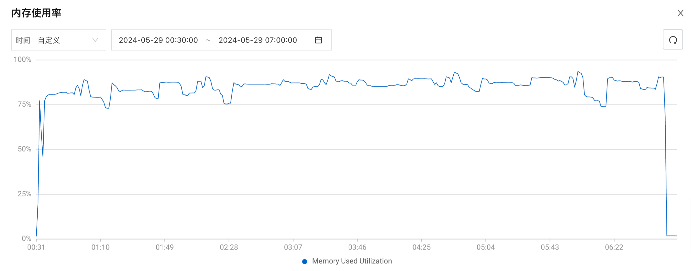

# Spark on ACK TPC-DS 基准测试

## 测试环境

本次基准测试使用的集群环境如下：

| 集群类型 | ACK Pro 版                                                   |
| -------- | ------------------------------------------------------------ |
| K8s 版本 | `1.28.9-aliyun.1`                                            |
| 地域     | 华北2（北京）                                                |
| 节点池   | spark-master 节点池：1 x  `ecs.g7.2xlarge`  spark-worker 节点池：8 x  `ecs.g7.8xlarge` |
| 操作系统 | Alibaba Cloud Linux 3.2104 LTS 64 位                         |
| 镜像 ID  | `aliyun_3_9_x64_20G_alibase_20231219.vhd`                    |
| 云盘     | 每个 worker 节点挂载 6 块 300 GB ESSD PL1 云盘和 1 块 40 GB ESSD PL0 云盘 |

## 运行基准测试

关于运行 TPC-DS 基准测试的详细步骤，请参考[运行 TPC-DS 基准测试](../tpcds-benchmark.md)。

## 基准测试结果

本次基准测试共运行 5 轮 TPC-DS 查询，每轮包含 104 条查询语句。基准测试运行时间为 `2024-05-29T00:33:50+08:00` 至 `2024-05-29T06:52:35+08:00` ，基准测试的原始结果已经保存至 `docs/benchmark/spark-on-ack/result.csv`，结果如下表所示：

| 查询名称    | 最短执行时间（秒） | 最长执行时间（秒） | 平均执行时间（秒） | 标准差（秒） |
| ----------- | ------------------ | ------------------ | ------------------ | ------------ |
| q1-v2.4     | 5.83               | 12.18              | 7.19               | 2.50         |
| q2-v2.4     | 21.13              | 22.66              | 21.66              | 0.58         |
| q3-v2.4     | 3.64               | 6.15               | 4.31               | 0.93         |
| q4-v2.4     | 351.11             | 356.02             | 354.57             | 1.80         |
| q5-v2.4     | 34.62              | 36.31              | 35.18              | 0.63         |
| q6-v2.4     | 12.44              | 15.80              | 13.65              | 1.16         |
| q7-v2.4     | 9.22               | 30.92              | 14.39              | 8.31         |
| q8-v2.4     | 7.05               | 8.21               | 7.48               | 0.40         |
| q9-v2.4     | 65.27              | 70.36              | 68.01              | 1.71         |
| q10-v2.4    | 7.57               | 8.67               | 8.13               | 0.36         |
| q11-v2.4    | 53.44              | 53.92              | 53.76              | 0.17         |
| q12-v2.4    | 3.95               | 5.64               | 4.43               | 0.62         |
| q13-v2.4    | 12.14              | 13.04              | 12.65              | 0.33         |
| q14a-v2.4   | 107.47             | 115.67             | 111.86             | 2.80         |
| q14b-v2.4   | 105.82             | 110.10             | 107.19             | 1.54         |
| q15-v2.4    | 13.70              | 14.15              | 13.95              | 0.14         |
| q16-v2.4    | 36.78              | 40.27              | 37.73              | 1.30         |
| q17-v2.4    | 13.00              | 13.45              | 13.13              | 0.17         |
| q18-v2.4    | 26.91              | 28.23              | 27.49              | 0.52         |
| q19-v2.4    | 6.53               | 6.79               | 6.68               | 0.10         |
| q20-v2.4    | 5.33               | 5.77               | 5.51               | 0.18         |
| q21-v2.4    | 1.87               | 2.35               | 2.08               | 0.17         |
| q22-v2.4    | 15.36              | 15.84              | 15.61              | 0.16         |
| q23a-v2.4   | 252.78             | 267.13             | 263.63             | 5.45         |
| q23b-v2.4   | 362.41             | 396.68             | 380.34             | 11.85        |
| q24a-v2.4   | 168.93             | 195.76             | 179.93             | 9.51         |
| q24b-v2.4   | 156.00             | 186.87             | 165.02             | 11.39        |
| q25-v2.4    | 9.96               | 10.71              | 10.39              | 0.28         |
| q26-v2.4    | 6.97               | 9.12               | 7.93               | 0.75         |
| q27-v2.4    | 8.53               | 10.06              | 9.31               | 0.53         |
| q28-v2.4    | 79.79              | 86.57              | 83.60              | 2.74         |
| q29-v2.4    | 35.33              | 37.73              | 36.61              | 0.83         |
| q30-v2.4    | 18.22              | 18.63              | 18.44              | 0.14         |
| q31-v2.4    | 15.94              | 21.28              | 18.40              | 1.99         |
| q32-v2.4    | 2.35               | 2.58               | 2.46               | 0.08         |
| q33-v2.4    | 8.45               | 12.33              | 10.58              | 1.45         |
| q34-v2.4    | 5.19               | 5.96               | 5.49               | 0.25         |
| q35-v2.4    | 20.84              | 24.23              | 22.19              | 1.15         |
| q36-v2.4    | 7.84               | 9.30               | 8.41               | 0.54         |
| q37-v2.4    | 18.84              | 23.09              | 20.43              | 1.63         |
| q38-v2.4    | 29.27              | 29.89              | 29.70              | 0.22         |
| q39a-v2.4   | 5.67               | 5.99               | 5.90               | 0.12         |
| q39b-v2.4   | 5.12               | 5.54               | 5.32               | 0.14         |
| q40-v2.4    | 11.52              | 11.86              | 11.67              | 0.12         |
| q41-v2.4    | 0.63               | 0.73               | 0.69               | 0.05         |
| q42-v2.4    | 1.58               | 2.11               | 1.85               | 0.20         |
| q43-v2.4    | 5.24               | 5.54               | 5.40               | 0.12         |
| q44-v2.4    | 28.84              | 34.31              | 31.28              | 1.84         |
| q45-v2.4    | 13.15              | 13.63              | 13.34              | 0.17         |
| q46-v2.4    | 11.29              | 12.27              | 11.76              | 0.32         |
| q47-v2.4    | 13.46              | 14.19              | 13.75              | 0.27         |
| q48-v2.4    | 11.24              | 12.10              | 11.71              | 0.33         |
| q49-v2.4    | 17.83              | 20.90              | 19.42              | 1.08         |
| q50-v2.4    | 95.75              | 103.65             | 100.25             | 2.56         |
| q51-v2.4    | 15.99              | 16.62              | 16.23              | 0.25         |
| q52-v2.4    | 1.70               | 1.89               | 1.77               | 0.07         |
| q53-v2.4    | 5.15               | 5.82               | 5.45               | 0.23         |
| q54-v2.4    | 9.88               | 10.56              | 10.25              | 0.23         |
| q55-v2.4    | 1.72               | 1.85               | 1.80               | 0.05         |
| q56-v2.4    | 9.62               | 12.20              | 11.28              | 0.97         |
| q57-v2.4    | 8.91               | 9.39               | 9.09               | 0.18         |
| q58-v2.4    | 3.50               | 3.77               | 3.64               | 0.10         |
| q59-v2.4    | 20.76              | 21.68              | 21.13              | 0.33         |
| q60-v2.4    | 13.26              | 13.91              | 13.48              | 0.23         |
| q61-v2.4    | 6.61               | 7.09               | 6.77               | 0.17         |
| q62-v2.4    | 7.16               | 7.64               | 7.42               | 0.16         |
| q63-v2.4    | 4.83               | 5.24               | 5.05               | 0.15         |
| q64-v2.4    | 118.19             | 122.85             | 120.38             | 1.65         |
| q65-v2.4    | 37.53              | 38.12              | 37.71              | 0.21         |
| q66-v2.4    | 11.57              | 12.74              | 11.88              | 0.43         |
| q67-v2.4    | 754.57             | 785.36             | 771.55             | 10.81        |
| q68-v2.4    | 7.23               | 7.73               | 7.45               | 0.23         |
| q69-v2.4    | 7.17               | 7.59               | 7.42               | 0.15         |
| q70-v2.4    | 13.04              | 14.66              | 13.80              | 0.68         |
| q71-v2.4    | 4.49               | 5.53               | 4.96               | 0.35         |
| q72-v2.4    | 30.60              | 32.15              | 31.22              | 0.56         |
| q73-v2.4    | 4.06               | 4.24               | 4.13               | 0.07         |
| q74-v2.4    | 43.92              | 45.09              | 44.51              | 0.40         |
| q75-v2.4    | 71.00              | 77.74              | 73.76              | 2.58         |
| q76-v2.4    | 37.64              | 44.78              | 41.62              | 3.05         |
| q77-v2.4    | 2.92               | 3.66               | 3.29               | 0.24         |
| q78-v2.4    | 135.54             | 138.92             | 137.50             | 1.51         |
| q79-v2.4    | 6.59               | 7.01               | 6.76               | 0.14         |
| q80-v2.4    | 30.76              | 33.96              | 31.76              | 1.14         |
| q81-v2.4    | 17.03              | 30.74              | 24.81              | 6.31         |
| q82-v2.4    | 36.56              | 38.96              | 38.08              | 1.02         |
| q83-v2.4    | 1.56               | 2.01               | 1.84               | 0.17         |
| q84-v2.4    | 7.54               | 8.45               | 7.98               | 0.33         |
| q85-v2.4    | 11.31              | 12.25              | 11.68              | 0.31         |
| q86-v2.4    | 4.17               | 7.46               | 4.85               | 1.30         |
| q87-v2.4    | 29.86              | 30.20              | 30.06              | 0.12         |
| q88-v2.4    | 68.95              | 73.47              | 70.99              | 1.50         |
| q89-v2.4    | 6.47               | 7.48               | 7.05               | 0.38         |
| q90-v2.4    | 7.55               | 7.85               | 7.72               | 0.14         |
| q91-v2.4    | 2.95               | 3.16               | 3.06               | 0.09         |
| q92-v2.4    | 1.73               | 2.45               | 1.96               | 0.26         |
| q93-v2.4    | 165.97             | 175.54             | 170.90             | 3.71         |
| q94-v2.4    | 27.42              | 29.64              | 28.47              | 0.88         |
| q95-v2.4    | 85.69              | 88.99              | 87.09              | 1.21         |
| q96-v2.4    | 10.45              | 11.14              | 10.74              | 0.25         |
| q97-v2.4    | 39.06              | 39.84              | 39.62              | 0.29         |
| q98-v2.4    | 6.65               | 7.63               | 7.31               | 0.36         |
| q99-v2.4    | 10.46              | 11.87              | 11.10              | 0.50         |
| ss_max-v2.4 | 24.56              | 26.19              | 25.53              | 0.63         |
| 总计        | 72 分钟 21 秒      | 78 分钟 18 秒      | 75 分钟 05 秒      |              |

## 性能分析

### OSS 使用带宽

OSS 使用带宽如下图所示：

本次基准测试使用带宽峰值为 79 Gb/s，单个阿里云账号在北京地域的 OSS 默认内外网总下载带宽为 100 Gb/s，OSS 带宽尚未达到瓶颈。

### CPU 使用率

Worker 节点池总共包含 6 个节点，随机选择其中一个节点查看各项性能指标。

CPU 使用率如下图所示：

CPU 使用率峰值为 96% 左右

### 内存使用率

内存使用率如下图所示：

内存使用率平均值为 86% 左右

### 系统负载

系统负载如下图所示：

系统负载平均值为 25% 左右，峰值为 38% 左右。

### 云盘读写 BPS

云盘读写 BPS 如下图所示：

云盘读写 BPS 峰值为 700 MB/s，即 5.5 Gb/s，`ecs.g7.8xlarge` 实例基础云盘带宽为 8 Gb/s，尚未达到瓶颈。

### 云盘读写 IOPS

云盘读写 IOPS 如下图所示：

云盘 IOPS 峰值为 4.5k 左右，`ecs.g7.8xlarge` 实例基础 IOPS 为 16 万，尚未达到瓶颈。

### 内网带宽

内网带宽如下图所示：

内网带宽峰值为 15 Gb/s 左右，`ecs.g7.8xlarge` 实例基础/突发网络带宽为 16/32 Gb/s，尚未达到瓶颈。
