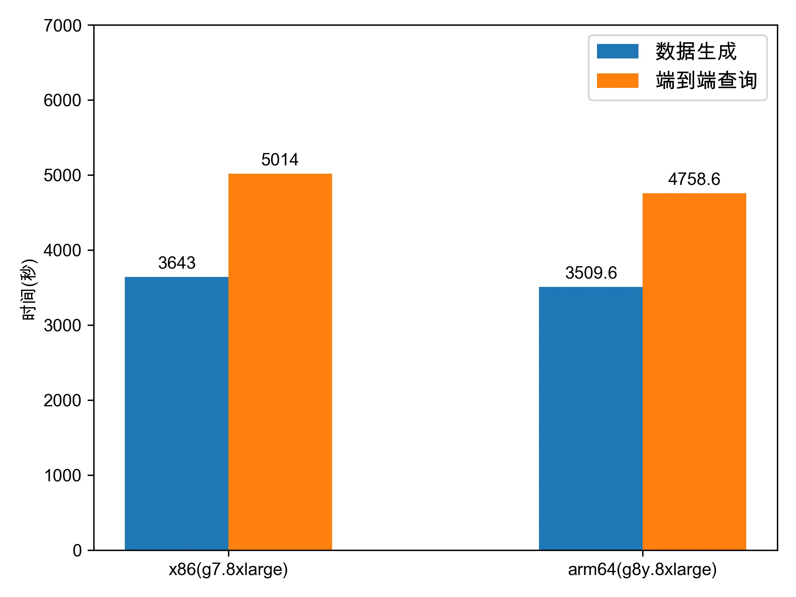
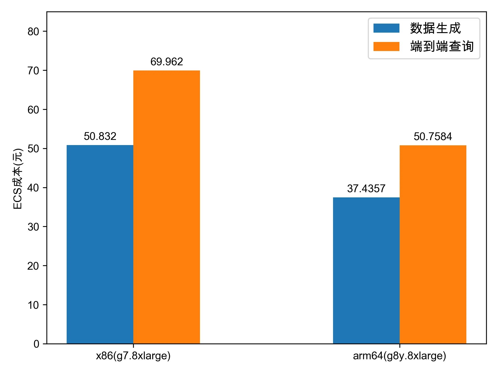

# Spark on ACK 基准测试之对比 x86_64 架构和 arm64 架构

为了对比 Spark on ACK 在 x86/arm64 架构下的性能和成本，本次基准测试创建了相同规模的 x86 架构和 arm64 架构 ACK 集群，它们具有相同的节点数量、vCPU 数量和内存大小，并挂载了相同数量和规模的云盘，区别主要在于 x86 架构集群使用了 g7 实例规格族 ECS，arm64 架构集群使用了 g8y 实例规格族 ECS。

## 基准测试环境

本次基准测试所使用的测试环境如下：

|              | **x86 架构**                                                 | **arm64 架构**                                              |
| ------------ | ------------------------------------------------------------ | ----------------------------------------------------------- |
| **集群类型** | ACK pro                                                      | ACK pro                                                     |
| **K8s 版本** | 1.26.3-aliyun.1                                              | 1.26.3-aliyun.1                                             |
| **地域**     | 华北2（北京）                                                | 华北2（北京）                                               |
| **实例规格** | ecs.g7.8xlarge（32 vCPU + 128 GB）                           | ecs.g8y.8xlarge（32 vCPU + 128 GB）                         |
| **节点数量** | 1 master 节点（g7.2xlarge）  6 worker 节点 （g7.8xlarge） | 1 master 节点 （g8y.2xlarge） 6 worker 节点 (g8y.8xlarge) |
| **操作系统** | Alibaba Cloud Linux 3.2104 LTS 64位                          | Alibaba Cloud Linux 3.2104 LTS 64位 ARM版                   |
| **镜像 ID**  | aliyun_3_x64_20G_alibase_20230727.vhd                        | aliyun_3_arm64_20G_alibase_20230515.vhd                     |

## 测试数据集

本次基准测试使用的测试数据集规模为 SF=3072，数据分区数量为 640。

## 测试结果

x86/arm64 性能对比如下图所示：

x86/arm64 成本对比如下图所示：

6 节点 3 TB 基准测试结果如下：

- 数据生成：arm64 相比于 x86 用时减少 `3.67%`，ECS 成本减少 `26.35%`。
- 端到端查询：arm64 相比于 x86 用时减少 `5.11%`，ECS 成本减少 `27.45%`。

注：

- ECS 成本的计算方式为：`总成本 = 查询总时间 x 集群单价`。
- 本次基准测试在 x86/arm64 架构下使用了相同的作业参数，但是未对作业参数进行调优，因此不代表最优性能，主要用于对比两种架构下的性能/成本。
