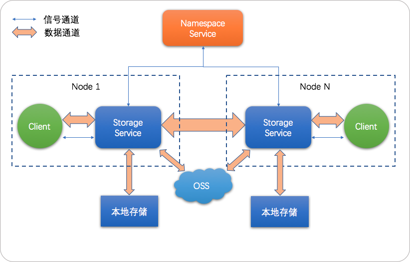

计算存储分离已经成为云计算的一种发展趋势。在计算存储分离之前，普遍采用的是传统的计算存储相互融合的架构，但是这种架构存在一定的问题，比如在集群扩容的时候会面临计算能力和存储能力相互不匹配的问题。用户在某些情况下只需要扩容计算能力或者存储能力，而传统的融合架构不能满足用户的这种需求，进行单独的扩充计算或者存储能力；其次在缩容的时候可能会遇到人工干预，人工干预完后需要保证数据在多个节点中同步，而当有多个副本需要同步时候，可能会造成的数据丢失。计算存储分离架构则可以很好的解决这些问题，使得用户只需要关心整个集群的计算能力，但同时也会引入读写数据网络延迟的问题。

JindoFS是一种云原生的文件系统，结合OSS和本地存储，成为E-MapReduce产品的新一代存储系统，为上层计算提供了高效可靠的存储。

JindoFS 提供了块存储模式（Block）和缓存模式（Cache）的存储模式。

JindoFS 采用了本地存储和OSS的异构多备份机制，Storage Service提供了数据存储能力，首先使用OSS作为存储后端，保证数据的高可靠性，同时利用本地存储实现冗余备份，利用本地的备份，可以加速数据读取；另外，JindoFS 的元数据通过本地服务Namespace Service管理，从而保证了元数据操作的性能（和HDFS元数据操作性能相似）。

