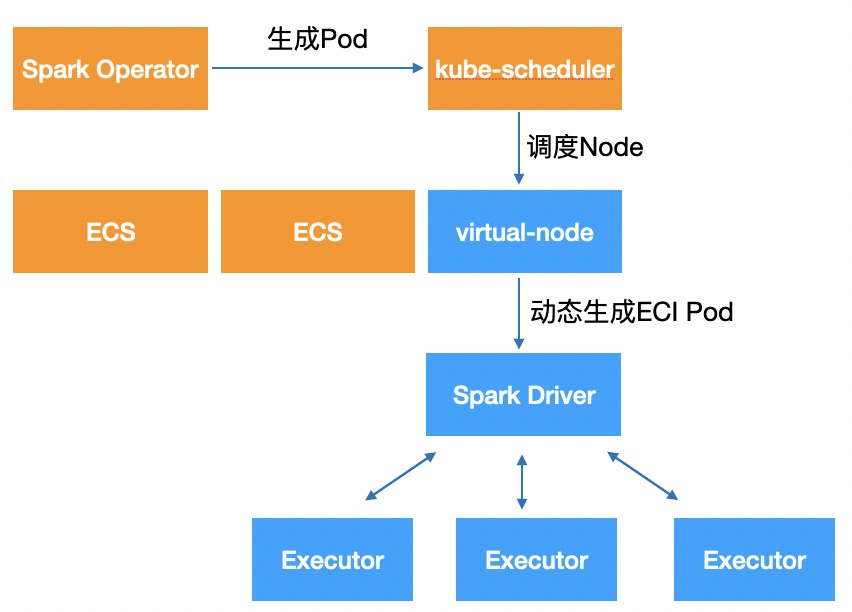

# Serverless Spark

## 什么是 Serverless Spark？

[弹性容器实例（Elastic Container Instance，ECI）](https://help.aliyun.com/ack/serverless-kubernetes/user-guide/eci-pod/)能够为 Kubernetes 提供基础的容器 Pod 运行环境，通过将 Spark 作业中的 Driver 和 Executor Pod 动态调度到 ECI 上，即可以实现无服务器 Spark 作业执行。每个容器实例底层通过轻量级虚拟化安全沙箱技术完全强隔离，容器实例间互不影响。



将 Spark 作业运行在 ECI 上具有以下优势：

- **超大容量**：集群无需额外配置既可获得最多 2 万 Pod 容量，无需提前规划容量。
- **秒级弹性**：可在极短时间内创建出数千个 Pod以交付大量算力，无需担心业务高峰期间 Pod 创建时延受到影响。
- **节约成本**：ECI Pod 按需创建，按量计费，不会由于资源闲置造成资源浪费，并且能够支持 Spot 实例、多种实例组合，节省成本。

## 如何将 Spark 作业运行在 ECI 上？

由于 ECI 节点被打上了特定的标签和污点，为了将 Spark 作业运行在 ECI 上，只需要在 Driver 或 Executor Pod 中添加如下配置。首先，nodeSelector 中需要添加 `type: virtual-kubelet` 以将 Pod 调度到 ECI 上。其次，tolerations 中需要添加额外的污点容忍，以容忍 ECI 的污点：

```yaml
nodeSelector:
  type: virtual-kubelet

tolerations:
- key: virtual-kubelet.io/provider
  operator: Equal
  value: alibabacloud
  effect: NoSchedule
```

```yaml
apiVersion: sparkoperator.k8s.io/v1beta2
kind: SparkApplication
metadata:
  name: spark-pi
spec:
  type: Scala
  mode: cluster
  image: apache/spark:3.5.0
  mainClass: org.apache.spark.examples.SparkPi
  mainApplicationFile: local:///opt/spark/examples/jars/spark-examples_2.12-3.5.0.jar
  sparkVersion: 3.5.0
  driver:
    cores: 1
    coreLimit: 1200m
    memory: 512m
    serviceAccount: spark
    annotations:
      k8s.aliyun.com/eci-use-specs: "2-4Gi"
    nodeSelector:
      type: virtual-kubelet
    tolerations:
    - key: virtual-kubelet.io/provider
      operator: Equal
      value: alibabacloud
      effect: NoSchedule
  executor:
    instances: 2
    cores: 2
    memory: 4g
    annotations:
      k8s.aliyun.com/eci-use-specs: "2-4Gi"
    nodeSelector:
      type: virtual-kubelet
    tolerations:
    - key: virtual-kubelet.io/provider
      operator: Equal
      value: alibabacloud
      effect: NoSchedule
```

在上面的示例中，我们通过注解 `k8s.aliyun.com/eci-use-specs: "2-4Gi"` 指定了 ECI Pod 的规格为 2 vCPU + 4 GiB 内存。需要注意的是，并不是所有的 vCPU 和内存规格组合都支持，具体请参考[通过指定 vCPU 和内存创建 ECI Pod](https://help.aliyun.com/ack/serverless-kubernetes/user-guide/specify-cpu-and-memory-specifications-to-create-an-elastic-container-instance/)。

指定 ECI Pod 规格有多种方式，例如指定 vCPU 和内存、指定 ECS 规格等，

## 

## 使用 ImageCache 加速镜像拉取

ECI 支持镜像缓存功能，以便 Kubernetes 用户可以加速镜像拉取，提升 Pod 创建速度。具体地说，ECI 提供了一种名为 ImageCache 的集群级别的 CRD 资源，详细的使用文档请参考[使用 ImageCache 加速创建 Pod](https://help.aliyun.com/ack/serverless-kubernetes/user-guide/use-image-caches-to-accelerate-the-creation-of-pods/)。

仍然以上面的 Spark 作业为例，其使用的镜像为社区镜像 `apache/spark:3.5.0`，我们对比一下使用 ImageCache 前后镜像的拉取速度。在使用之前，我们查看 driver pod 的事件：

```shell
$ kubectl describe pod spark-pi-driver
...
Events:
  Type     Reason                 Age   From               Message
  ----     ------                 ----  ----               -------
  Normal   Scheduled              24m   default-scheduler  Successfully assigned spark-operator/spark-pi-driver to virtual-kubelet-cn-beijing-i
  Normal   UserInstanceTypeSpec   24m   EciService         [eci.containergroup]The user-specified instanceType for current eci instance is 2.0-4.0Gi
  Warning  ImageCacheMissed       24m   EciService         [eci.imagecache]Missed image cache.
  Normal   ImageCacheAutoCreated  24m   EciService         [eci.imagecache]Image cache imc-2ze5hdcnngenmwc1jmwf is auto created
  Normal   Pulling                24m   kubelet            Pulling image "apache/spark:3.5.0"
  Normal   Pulled                 23m   kubelet            Successfully pulled image "apache/spark:3.5.0" in 1m41.289s (1m41.289s including waiting)
  Normal   Created                23m   kubelet            Created container spark-kubernetes-driver
  Normal   Started                23m   kubelet            Started container spark-kubernetes-driver
```

事件显示 ImageCache 未命中，并创建了新的 ImageCache，其 ID 为 `imc-2ze5hdcnngenmwc1jmwf`。接下来，我们在 Driver 和 Executor 中添加如下注解以明确指定该镜像缓存：

```yaml
annotations:
  k8s.aliyun.com/eci-image-snapshot-id: imc-2ze5hdcnngenmwc1jmwf
```

再次执行作业，观察 driver pod 的镜像拉取速度：

```shell
$ kubectl describe pod spark-pi-driver
...
Events:
  Type    Reason                   Age   From               Message
  ----    ------                   ----  ----               -------
  Normal  Scheduled                13s   default-scheduler  Successfully assigned spark-operator/spark-pi-driver to virtual-kubelet-cn-beijing-i
  Normal  UserInstanceTypeSpec     24s   EciService         [eci.containergroup]The user-specified instanceType for current eci instance is 2.0-4.0Gi
  Normal  SuccessfulHitImageCache  23s   EciService         [eci.imagecache]Successfully hit image cache imc-2ze5hdcnngenmwc1jmwf, eci will be scheduled with this image cache.
  Normal  Pulled                   4s    kubelet            Container image "apache/spark:3.5.0" already present on machine
  Normal  Created                  4s    kubelet            Created container spark-kubernetes-driver
  Normal  Started                  3s    kubelet            Started container spark-kubernetes-driver
```

Driver pod 事件显示镜像缓存成功命中，无需再次拉取镜像。

实际使用过程中，可以在 Driver/Executor Pod 中添加如下注解以实现自动创建和匹配镜像缓存，而无需明确指定镜像缓存 ID：

```yaml
annotations:
  k8s.aliyun.com/eci-image-cache: "true"
```
