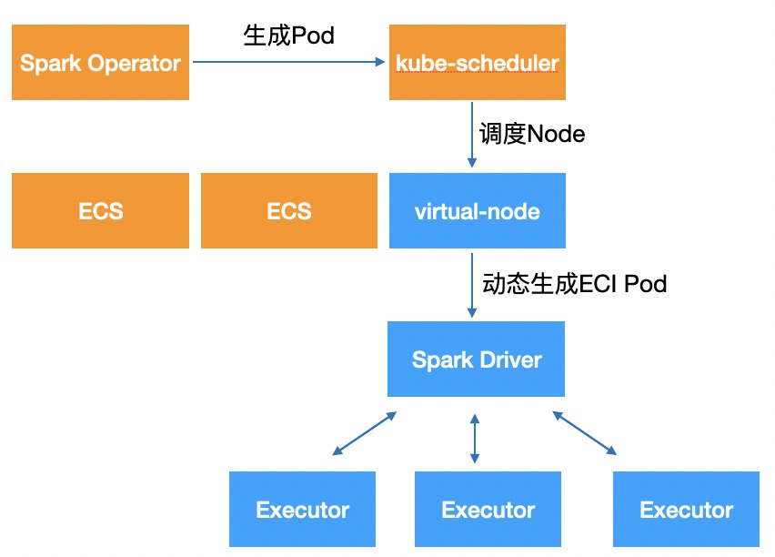

通过将Spark的Driver和Executor动态调度到ECI上，实现无服务器Spark作业执行，存储和计算分离，可在几十秒内交付大量算力。并能够支持Spot实例、多种实例组合，节省成本。
我们只需要在创建Driver或Executor时通过指定nodeSelector、tolerations就可以把Spark作业运行在ECI上。



```yaml
executor:
  cores: 8
  instances: 20
  memory: "20480m" 
  annotations:
    k8s.aliyun.com/eci-use-specs: "8-32Gi"
  nodeSelector:
    type: virtual-kubelet
  tolerations:
    - key: virtual-kubelet.io/provider
      operator: Exists
```
