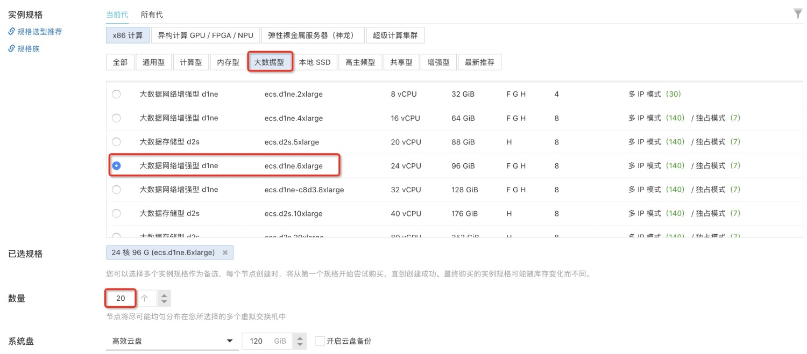
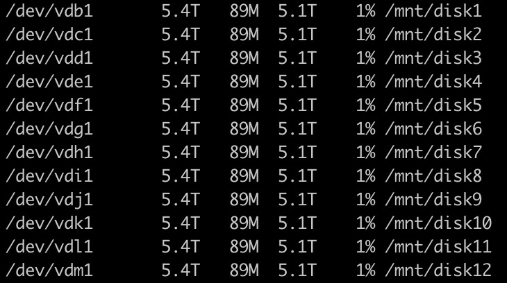
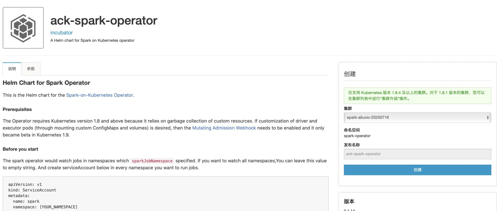
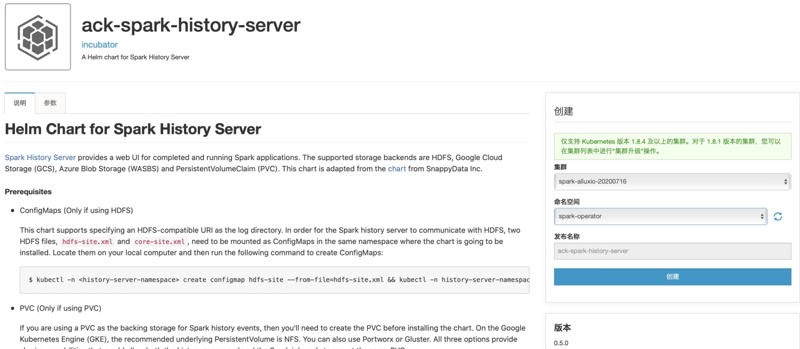

1. [测试环境搭建](benchmark_env.md)
2. [测试代码开发](benchmark_code.md)
3. [Spark on ACK测试](benchmark_steps.md)
4. [测试结果分析](benchmark_result.md)
5. [问题排查定位](debugging_guide.md)

## 环境准备

### 1）ACK集群

创建ACK标准专有集群，其中worker节点采用大数据网络增强型的ecs.d1ne.6xlarge规格，共20个节点。




其中每个ecs.d1ne.6xlarge自带12块5TB的HDD数据盘，需要对这12个数据盘进行分区格式化挂载，操作步骤请参考[分区格式linux数据盘](https://help.aliyun.com/document_detail/34377.html?spm=a2c4g.11174283.6.813.4be652feB9omRD#title-f8r-9od-yn9)。格式化并挂载完成后，执行df -h，可以看到如下的挂载情况。/mnt目录下的12个文件路径会在Alluxio中用到。




### 2）OSS

在阿里云OSS控制台上开通OSS服务，并创建一个bucket用来存放tpc-ds生成的数据、测试结果和测试过程中的日志等。本次实验中的bucket名字为cloudnativeai。


### 3）安装ack-spark-operator

在ack管控台，**市场**-**应用目录**中找到ack-spark-operator，点击右侧“**创建**”按钮，安装spark operator。



安装完成后，执行命令查看是否成功

```shell
kubectl get deployment ack-spark-operator -n spark-operator
```


### 4）安装ack-spark-history-server



ack-spark-history-server通过记录spark执行任务过程中的日志和事件信息，并提供UI界面，帮助排查问题。

**市场**-**应用目录**中找到ack-spark-history-server，在参数页中配置oss相关信息，存储spark历史数据，点击右侧“**创建**”按钮，安装spark history server。

```yaml
oss:
  enableOSS: false
  # Please input your accessKeyId
  alibabaCloudAccessKeyId: ""
  # Please input your accessKeySecret
  alibabaCloudAccessKeySecret: ""
  # oss bucket endpoint such as oss-cn-beijing.aliyuncs.com
  alibabaCloudOSSEndpoint: ""
  # oss file path such as oss://bucket-name/path
  eventsDir: "oss://cloudnativeai/spark/spark-events"
```

安装完成后，执行命令查看是否成功

```shell
kubectl get service ack-spark-history-server -n {YOUR-NAMESPACE}
```


### 5）安装Alluxio

alluxio需要在ack中通过helm安装，首先下载alluxio。

```shell 
wget http://kubeflow.oss-cn-beijing.aliyuncs.com/alluxio-0.6.8.tgz
tar -xvf alluxio-0.6.8.tgz
```

然后在alluxio同级目录下新建一个config.yaml配置文件，关键配置如下：

```yaml
# Site properties for all the components
properties:
  fs.oss.accessKeyId: YOUR-ACCESS-KEY-ID
  fs.oss.accessKeySecret: YOUR-ACCESS-KEY-SECRET
  fs.oss.endpoint: oss-cn-beijing-internal.aliyuncs.com
  alluxio.master.mount.table.root.ufs: oss://cloudnativeai/
  alluxio.master.persistence.blacklist: .staging,_temporary
  alluxio.security.stale.channel.purge.interval: 365d
  alluxio.user.metrics.collection.enabled: 'true'
  alluxio.user.short.circuit.enabled: 'true'
  alluxio.user.file.write.tier.default: 1
  alluxio.user.block.size.bytes.default: 64MB #default 64MB
  alluxio.user.file.writetype.default: CACHE_THROUGH
  alluxio.user.file.metadata.load.type: ONCE
  alluxio.user.file.readtype.default: CACHE
  #alluxio.worker.allocator.class: alluxio.worker.block.allocator.MaxFreeAllocator
  alluxio.worker.allocator.class: alluxio.worker.block.allocator.RoundRobinAllocator
  alluxio.worker.file.buffer.size: 128MB
  alluxio.worker.evictor.class: alluxio.worker.block.evictor.LRUEvictor
  alluxio.job.master.client.threads: 5000
  alluxio.job.worker.threadpool.size: 300
```

其中oss的相关的accessKey、endpoint等信息需要替换成自己的。

```yaml
tieredstore:
  levels:
    - level: 0
      alias: HDD
      mediumtype: HDD-0,HDD-1,HDD-2,HDD-3,HDD-4,HDD-5,HDD-6,HDD-7,HDD-8,HDD-9,HDD-10,HDD-11
      path: /mnt/disk1,/mnt/disk2,/mnt/disk3,/mnt/disk4,/mnt/disk5,/mnt/disk6,/mnt/disk7,/mnt/disk8,/mnt/disk9,/mnt/disk10,/mnt/disk11,/mnt/disk12
      type: hostPath
      quota: 1024G,1024G,1024G,1024G,1024G,1024G,1024G,1024G,1024G,1024G,1024G,1024G
      high: 0.95
      low: 0.7
```

tieredstore中的中的mediumtype、path对应ack worker节点中挂载的数据盘。

完整的配置文件请参考[config.yaml](kubernetes/alluxio/config.yaml)，下载config.yaml配置文件并修改配置，给ACK集群中的worker节点打上“alluxio=true”标签，然后通过helm命令安装alluxio。

安装alluxio

```shell
helm install -f config.yaml -n alluxio alluxio alluxio
```

安装完成后，执行命令查看是否成功

```shell
kubectl get pod -n alluxio
```

然后进入alluxio-admin，查看数据盘挂载是否成功

```shell
kubectl exec -it alluxio-master-0 -n alluxio -- /bin/bash

./bin/alluxio fsadmin report capacity
```

如果能看到每个worker节点上都有挂载的数据盘，说明Alluxio安装配置成功。

