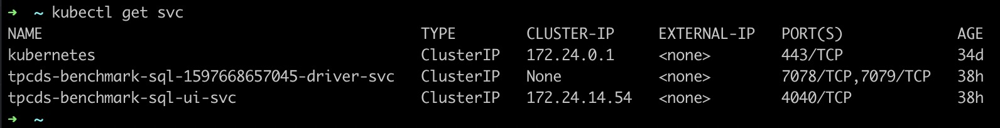
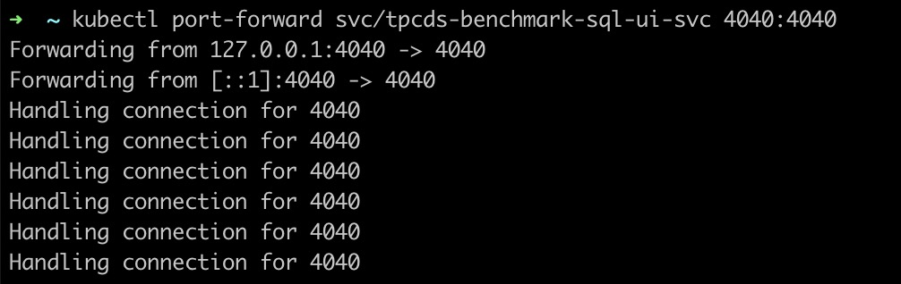
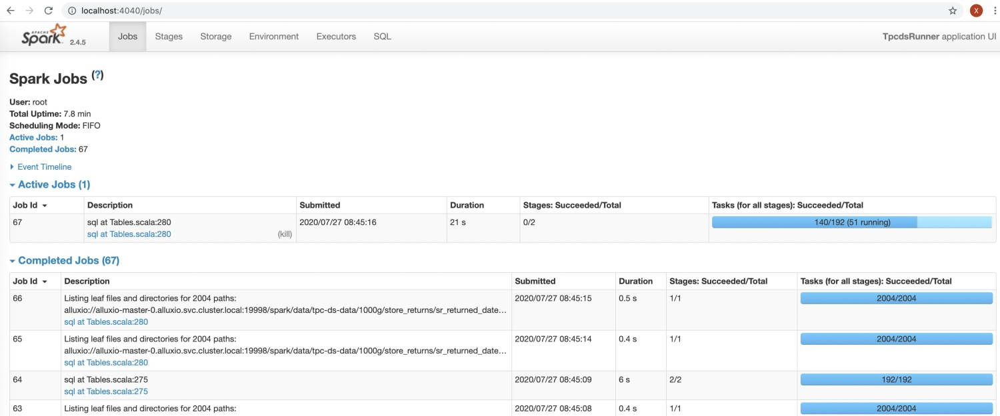
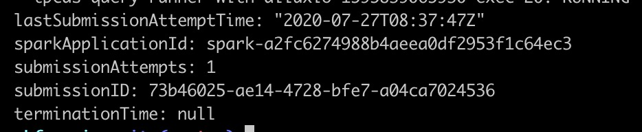
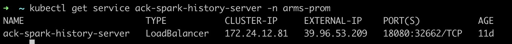

1. [测试环境搭建](benchmark_env.md)
2. [测试代码开发](benchmark_code.md)
3. [Spark on ACK测试](benchmark_steps.md)
4. [测试结果分析](benchmark_result.md)
5. [问题排查定位](debugging_guide.md)

测试过程中，如果参数配置不对，比如内存太小，很容器出现OOM等异常，这里可以通过两种方式来排查问题。以执行tpcds-query-runner-with-alluxio为例说明。

## spark-ui

任务运行过程中，可以通过spark-ui实时看到每个sql的执行情况，方式如下：

执行 kubectl get services 可以看到如下信息：



其中tpcds-benchmark-sql-ui-svc即spark-ui对应的service。

执行下面命令：

```shell
kubectl port-forward svc/tpcds-benchmark-sql-ui-svc 4040:4040
```

可以看到

### 

然后在浏览器中输入：localhost:4040，就可以看到spark-ui中的任务执行情况。




## ack-spark-history-server

任务结束后，如果想看到历史数据，可以采用这种方式，操作步骤如下：

执行如下命令，获取SparkApplication任务id。

```shell
kubectl get sparkapplication tpcds-benchmark-sql -o yaml
```



在上图中可以得到sparkApplicationId。

然后再获得ack-spark-history-server的endpoint

```shell
kubectl get service ack-spark-history-server 
```



然后在浏览器中输入上图中的 EXTERNAL-IP和端口，就可以看到所以spark任务的历史数据，再通过上一步找到的sparkApplicationId找到对应记录即可。